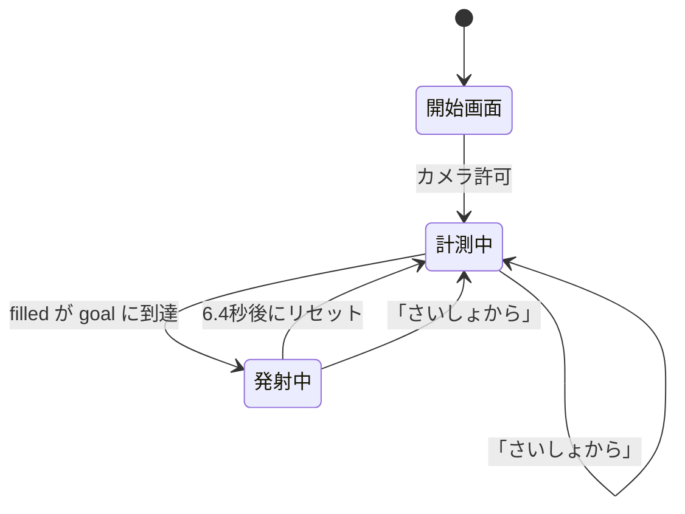

# もぐもぐカメラ 設計書

最終更新: 2026-08-18

## 1. 目的と前提

食事がすすまない子どもに、食べる動作そのものを楽しくするアプリ。
口を動かすと「ひとくち」として数え、すすみぐあいが溜まっていく。
満タンになるとロケットが発射する。

設計上の前提。

- **持ち主は子ども、設定するのは大人。** 子どもが触る要素は大きく単純に、
  細かい調整は設定パネルの中にしまう
- **検知は必ず外す。** 顔認識ではなくフレーム差分なので、誤検知も不検知も起きる。
  「外れても遊びが止まらない」ことを最優先にし、手動で進める道を常に用意する
- **端末はスマートフォン。** 縦持ち、片手、性能は低め。演出は派手にしたいが
  フレーム落ちさせない（→ [CLAUDE.md](../CLAUDE.md)）

## 2. 全体構成

`index.html` 1ファイル。ビルド不要、依存ライブラリなし。
即時実行関数の中に全体を閉じ込め、外へは診断用の `window.__mogu` だけを出す。

1ファイルにしている理由は、配布が「このファイルを開くだけ」で済むこと、
子どもの端末に何かをインストールさせないこと。

構成は次の4つに分かれる。

| 層 | 役割 | 主な関数 |
|---|---|---|
| 入力 | カメラ映像からひとくちを検出する | `startCamera` / `detect` |
| 進行 | ひとくちを盤面と状態に反映する | `onBite` / `setGoal` / `buildBoard` |
| 演出 | 音・パーティクル・発射シーケンス | `completeSequence` / `drawParts` / 音の各関数 |
| 設定 | 保存・復元とパネルの操作 | `save` / `load` / `applyRingSize` / `applyDetectMode` |

## 3. 画面レイアウト

全画面の `#stage` の上に、絶対配置で重ねる。

```
┌─ #stage ─────────────────────────────────┐
│ video (object-fit:cover)                 │  背面
│ #fx     全画面キャンバス（パーティクル）  │
│ #ring   検知範囲。ドラッグ／ピンチ可      │
│ #flash  白フラッシュ           z-index:2 │
│ #shock  衝撃波の輪             z-index:3 │
│ #bigRocket 大ロケット          z-index:4 │
│ #shout  ほめ言葉・カウント     z-index:5 │
│ #topbar / #biteBtn             z-index:6 │
│ #panel  設定パネル             z-index:7 │
│ #start  開始画面               z-index:8 │
│ #rocket はっしゃ台（左下）と #bento（下）は排他 │
└──────────────────────────────────────────┘
```

### 縦位置の基準 `--deck`

おべんとう箱の高さは完了口数によって変わる（1段か2段か）。
そこで CSS 変数 `--deck` に**実測した弁当箱の高さ + 26px** を入れ、
「たべた！」ボタン・はっしゃ台のロケット・設定パネルはこれを基準に配置する。
`layoutDeck()` が盤面の組み直し時、表示の切り替え時、画面リサイズ時に更新する。

こうしておかないと、口数を増やしたとき弁当箱がボタンに重なる。
おべんとう箱を出していないとき（ロケット表示中）は 24px に落として下へ寄せる。

### わっかの大きさ

CSS 変数 `--ring-size`（vmin）に一本化している。
表示サイズと検知範囲がずれると「見えている輪の外に反応する」ことになるため、
JS 側の比率 `ringR` は必ず `ringVmin / 200` で同期させる（直径 vmin → 半径比）。

## 4. 状態モデル



保持する状態。

| 変数 | 意味 | 備考 |
|---|---|---|
| `bites` | 累計のひとくち数 | 表示専用。リセットまで増え続ける |
| `filled` | いま埋まっているマス数（0〜`goal`） | 盤面の真実はこちら |
| `goal` | 完了までの口数（2〜12） | |
| `running` | カメラが動いている | ループの停止条件 |
| `launching` | 発射シーケンス進行中 | |

**`bites` と `filled` を分けている理由。** 発射シーケンス中にも検知は起きうる。
マスの位置を `bites % goal` で求めていると、シーケンス中の1口でマス番号がずれて
盤面が壊れる。`filled` を独立させ、`launching` 中は `filled` を進めず
カウントと歓声だけ返すようにしている。

## 5. 口の動きの検知

顔認識は使わない。**わっかの内側だけのフレーム差分**で判定する。

### 手順

1. 映像を 96×72 の作業キャンバスへ縮小して描く
2. 輝度に変換（`0.299R + 0.587G + 0.114B`）
3. わっか内側（ROI）だけ、前フレームとの差の絶対値の平均 `mean` を取る
   - ROI 中心 = `(ringPos.x × 96, ringPos.y × 72)`
   - ROI 半径 = `ringR × 72 × 1.6`（表示の輪よりやや広く見る）
4. `score = mean - baseline` が `threshold` を超えたら1口

### パラメータ

| 項目 | 値 | 意図 |
|---|---|---|
| 判定の頻度 | 約90msごと（約11回/秒） | 毎フレーム判定するとコストに見合わない |
| ならし運転 | 最初の30回 | `baseline` を作る間は発火させない |
| `baseline` の追従 | `× 0.97 + mean × 0.03` | ゆっくり順応させ、明るさ変化に強くする |
| `threshold` | `14 − はんのうしやすさ`（13〜4） | |
| 連続発火の抑止 | 2000ms | 1回の咀嚼で何度も数えない |

### 学習のやり直し

見る範囲や条件が変わったら `prevGray = null; warm = 0` に戻す。
やり直す契機は、わっかの移動・サイズ変更、検知のオン切り替え、
カメラの開始と切替、タブが隠れたとき。

### 誤検知への備え

このアルゴリズムは口以外の動き（手、通行人、照明の点滅）も拾う。
そのため対策を3段構えにしている。

1. わっかを小さく・口に合わせる（範囲を絞る）
2. 「はんのう しやすさ」を下げる（しきい値を上げる）
3. **「うごきを みる」をオフにする**（検知そのものを止め、手動のみにする）

3 が最終手段で、オフの間は描画ループから `detect()` を呼ばない。
わっかは薄い点線になり、ラベルが「てどうモード」に変わる。

## 6. 盤面（おべんとう箱と燃料ゲージ）

### どちらか一方だけを出す

すすみぐあいの表示は2つあるが、**同時には出さない**。
おべんとう箱と燃料ゲージは「あと何口か」を示すという同じ役割なので、
両方出すと同じことを2か所で見せることになり、視線が散る。

`showBoards()` が設定「ロケット」に応じて片方だけ表示する。

| ロケット | 出るもの | 完成時の言葉 |
|---|---|---|
| オン | 燃料ゲージ（左下） | 「ねんりょう まんタン！」 |
| オフ | おべんとう箱（下） | 「おべんとう かんせい！」 |

マスの DOM は表示していないときも `goal` ぶん作ってある。
`filled` を唯一の真実として扱い、表示だけを切り替える方が状態が単純になるため。

おべんとう箱を出していないときは `--deck` を 24px に落とし、
「たべた！」ボタンとロケットを画面の下ぎりぎりに寄せる。

燃料ゲージは単独で進捗を示すことになるので、幅を 26px 取っている。

### 組み立ての規則

`buildBoard()` が `goal` に合わせてマスとゲージ段を作り直す。

| 項目 | 規則 |
|---|---|
| おかずの絵文字 | 6種を `OKAZU[i % 6]` で循環 |
| 列数 | `goal ≤ 6` なら `goal`、それ以上は `ceil(goal / 2)`（2段組） |
| 弁当箱の横はば | `min(92vw, 列数 × 76px)` |
| ゲージの高さ | `min(190, max(112, goal × 16))` px |
| 炎の伸び幅 | 1口あたり `max(3, round(38 / goal))` px |

**横はばを列数から決めている理由。** `1fr` の列と `aspect-ratio:1/1` を
組み合わせると、列が少ないときに1マスが 219px まで肥大した。
横はばに上限を与えることで、どの口数でも1マス 63〜68px に収まる。

途中で `goal` を変えたときは `filled` を新しい `goal` に丸める。
減らして到達済みになった場合は、そのままお祝いへ進む。

## 7. 発射シーケンス

`completeSequence()`。すべてのタイマーを `seqTimers` に積み、
`clearSeq()` で一括して止められるようにしてある（「さいしょから」対策）。

### ロケットあり

| 時刻 | 内容 |
|---|---|
| 0.6s | 完成の合図（表示に応じて「ねんりょう まんタン！」／「おべんとう かんせい！」）＋ファンファーレ＋音声 |
| 1.4s | はっしゃ台のロケットが消え、大ロケットが画面下から中央へせり上がる（`whoosh`） |
| 2.1s | エンジン始動。震え（`.rev`）＋画面シェイク |
| 2.2 / 2.8 / 3.4s | カウントダウン 3・2・1。炎が 40 → 62 → 84px に伸びる |
| 4.0s | 発射。フラッシュ・衝撃波・強シェイク・轟音、炎110pxで画面外へ |
| 5.9s | シェイク終了 |
| 6.4s | 「また あしたも たべようね」＋盤面リセット |

### ロケットなし

0.6s にお祝い、0.7s から 6回の紙ふぶき、3.0s にリセット。

### 大ロケットの二重構造

中央寄せの `transform: translate(-50%, -50%)` と、演出の
`translateY` / `scale` は同じプロパティなので衝突する。
外側 `#bigRocket` で中央寄せ、内側 `#bigStack` にアニメーションを当てて分離している。

## 8. パーティクル

種別は3つ。すべて同じ配列 `parts` に入れ、`kind` で描き分ける。

| kind | 用途 | 既定の減衰 / 重力 |
|---|---|---|
| （なし） | 絵文字。ほめ言葉のバーストと星のお祝い | 0.016 / 0.28 |
| `spark` | ロケットの噴射（加算合成の火花） | 0.026〜0.048 / 0.03 |
| `smoke` | 発射台の煙 | 0.010〜0.020 / −0.01（上昇） |

### 描画方式

**絵柄は起動時に 64×64 のキャンバスへ焼いておき、毎フレームは `drawImage` で貼るだけ。**
火花は色相6種（hue 18〜48）、煙1種、絵文字は使うものだけ焼く。

毎フレーム・毎粒で `createRadialGradient` や `ctx.font` 代入＋`fillText` を
呼ぶと、1244個で 38.45ms/フレーム（26fps）まで落ちた。
スプライト化と個数削減の両方で 3.19ms になった。数値と根拠は
[CLAUDE.md](../CLAUDE.md) と [作業履歴](作業履歴.md) を参照。

描画は種別ごとにまとめ、`globalCompositeOperation` の切替を1フレーム2回に抑える。
1粒ごとの `save()` / `restore()` は呼ばない。

### 量の制御

- 上限 `MAX_PARTS = 460`。超えたら古いものから `splice` で捨てる
- 生成数はすべて `amount(n) = round(n × fxScale)` を通す
- `fxScale` は描画ループがフレーム時間を見て自動調整する
  （26ms超で −0.06、19ms未満で +0.01、下限 0.35）

## 9. 音

Web Audio でその場で合成する。音声ファイルは持たない。
`audio()` が初回タップ時に `AudioContext` を作り、`suspended` なら再開する
（iOS の自動再生制限のため、必ずユーザー操作の中で呼ぶ）。

| 関数 | 音 | 実装 |
|---|---|---|
| `chime(i)` | ひとくちの音 | 6音階＋1オクターブ上を重ねる |
| `charge(ratio)` | 燃料が溜まる音 | ノコギリ波を上向きにスイープ。溜まるほど高く大きく |
| `beep(f)` | カウントダウン | 矩形波 0.18s |
| `fanfare()` | 完成 | 4音を 0.12s ずつ |
| `whoosh()` | 大ロケット登場 | ホワイトノイズ＋バンドパスを 300→2600Hz |
| `rumble(dur)` | 発射の轟音 | ノイズ＋ローパスのスイープと、低音ノコギリ波を重ねる |
| `speak(text)` | ほめる声 | `speechSynthesis`（ja-JP）。非対応環境では黙って何もしない |

## 10. 設定の保存

`localStorage` のキー `mogumogu-camera:v1` に JSON で保存する。

```json
{
  "ringVmin": 34,
  "ringPos": { "x": 0.5, "y": 0.55 },
  "goal": 6,
  "sens": "5",
  "detect": true,
  "snd": true,
  "voice": true,
  "rocket": true
}
```

読み込み時は必ず範囲と型を検証してから使う。
`localStorage` が使えない環境（プライベートモードなど）でも動くよう、
保存・読み込みはどちらも例外を握りつぶす。

## 11. アクセシビリティ

- `prefers-reduced-motion` のとき、シェイク・フラッシュ・炎の揺らぎ・跳ねを止め、
  粒の数を減らし、発射アニメーションを短くする
- わっかはキーボードでも操作できる（矢印キーで移動、`+` / `-` で拡縮）
- ボタンには `aria-label`、フォーカスリングは `:focus-visible` で明示
- 文字はすべてひらがな中心。子どもが読む前提

## 12. 診断用インターフェース

`window.__mogu` から次を触れる。自動テストと性能計測に使う。

| 名前 | 用途 |
|---|---|
| `onBite()` / `burst()` / `exhaust()` / `completeSequence()` | 演出を直接呼ぶ |
| `bites` / `filled` / `goal` | 進行状態を読む |
| `parts` / `fxScale` / `frameMs` | 性能を読む |
| `setGoal(n)` / `setRingSize(v)` | 設定を変える |

## 13. 既知の制約

- **検知は口以外の動きも拾う。** 手や通行人、照明の点滅で反応することがある。
  設計上「外れる前提」なので、手動モードで運用しても遊びは成立する
- **カメラの権限が必須。** 拒否された場合は開始画面にエラーを出して先へ進まない
- 映像は `object-fit: cover` で切り取られるが、検知は映像フレーム全体を
  基準に座標を取る。画面の縦横比が映像と大きく違うと、
  わっかの表示位置と実際に見ている位置がわずかにずれる

## 14. 拡張するなら

- おかずの絵文字やほめ言葉は配列（`OKAZU` / `PRAISE` / `VOICE_LINES`）を
  差し替えるだけで変えられる。マス数は `goal` から自動で追従する
- 演出を足すときは、必ず [CLAUDE.md](../CLAUDE.md) の性能基準と
  計測手順に沿って数字を出してから入れること
