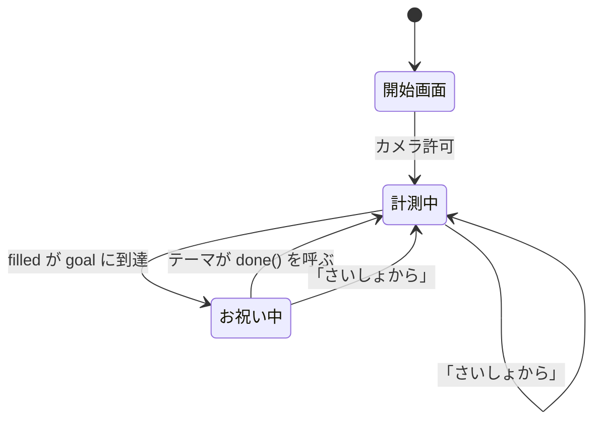

# もぐもぐカメラ 設計書

最終更新: 2026-08-19

## 1. 目的と前提

食事がすすまない子どもに、食べる動作そのものを楽しくするアプリ。
口を動かすと「ひとくち」として数え、すすみぐあいが溜まっていく。
満タンになると、えらんだ演出でお祝いが起こる。

設計上の前提。

- **持ち主は子ども、設定するのは大人。** 子どもが触る要素は大きく単純に、
  細かい調整は設定パネルの中にしまう
- **検知は必ず外す。** 顔認識ではなくフレーム差分なので、誤検知も不検知も起きる。
  「外れても遊びが止まらない」ことを最優先にし、手動で進める道を常に用意する
- **端末はスマートフォン。** 縦持ち、片手、性能は低め。演出は派手にしたいが
  フレーム落ちさせない（→ [CLAUDE.md](../CLAUDE.md)）
- **演出は増え続ける。** 子どもの好みは変わるし、兄弟で違うものを欲しがる。
  演出を足すことが「いちばん起きる変更」だと想定して構造を決める

## 2. 全体構成

### 責任の分割

かつては `index.html` 1ファイル（1034行）に全部入っていた。演出を増やすたびに
同じファイルが膨らみ、検知の修正と演出の修正が同じ場所でぶつかるようになったため、
ES モジュールで層に分けた。

```
index.html          骨組みだけ。DOM の器と、CSS / main.js の読み込み
styles/
  base.css          共通の見た目
  themes.css        テーマごとの見た目
src/
  main.js           組み立て役
  config.js         差し替えたいものを1か所に
  core/  bus / store / state
  input/ camera / motion / ring
  fx/    particles / sound / screen
  ui/    panel / hud
  themes/ index + bento / rocket / princess / patrol
```

| 層 | 役割 | 知っていること | 知らないこと |
|---|---|---|---|
| `core` | 設定・進行状態・連絡 | 数値と状態だけ | DOM、見た目 |
| `input` | 映像から「ひとくち」を取り出す | カメラ、わっかの位置 | すすみぐあい、演出 |
| `fx` | 見せる道具を貸す | 描画と音の技術 | いつ何を出すか |
| `ui` | 操作の受付 | 設定項目の一覧 | 演出の中身 |
| `themes` | すすみぐあいの見せかたとお祝い | 自分の DOM と ctx | 検知、保存、他のテーマ |
| `main` | 線をつなぐ | 全部 | 判断（何も決めない） |

**ひとことで言うと**、「ひとくち検知して数える」核と「それをどう見せるか」を
完全に切り離した。核は演出を1つも知らないし、演出は検知を1つも知らない。

### モジュール同士は直接呼ばない

連絡はすべて `core/bus.js` のイベントバスを通す。

```
motion → bus("motion:bite") → main → state.bite()
state  → bus("bite")        → main → theme.progress() / theme.bite()
state  → bus("complete")    → main → theme.celebrate()
store  → bus("settings:change") → main / panel / ring
```

こうしておくと、あとから受け手を足すときに送り手を触らなくて済む。
たとえば「ひとくちごとに記録を残す」機能を足したければ、
`bus.on("bite", ...)` を1つ増やすだけで、検知にも演出にも手を入れない。

## 3. テーマ（演出プラグイン）

**これがこの設計の中心。** 演出を増やすことが最も頻繁な変更だと想定しているので、
テーマを足すときに既存のコードを一切触らなくてよいようにしてある。

### 約束ごと

```js
export default {
  id, label, lead,           // 識別子、パネルの表示名、開始画面の説明
  mount(ctx),                // ctx.layer の中に自分の DOM を作る
  unmount(),                 // 片付ける
  build(goal),               // 完了口数に合わせて組み直す
  progress(filled, goal),    // すすみぐあいを反映する
  bite(filled, goal),        // ひとくちごとの小さな演出
  celebrate(goal, done),     // お祝い。終わったら done() を呼ぶ
  reset(),                   // 盤面を戻す
};
```

### 渡される道具（ctx）

| 名前 | 用途 |
|---|---|
| `layer` | 自分用の DOM の置き場所 |
| `fx` | パーティクル（`burst` / `spark` / `blast` / `smoke` / `drift`） |
| `sound` | 音（`tone` / `noise` と、できあいの `chime` `siren` `boom` など） |
| `speech` | 読み上げ |
| `shout` | 画面まんなかの文字 |
| `screen` | `flash()` / `shake(ms, hard)` |
| `later(fn, ms)` | あとで実行。リセット時に自動で取り消される |
| `every(fn, ms, total)` | くり返し。**止めるのを忘れられない形**にしてある |
| `reduceMotion` | 動きを控える設定か |
| `figure(key, emoji, cls)` | 画像か絵文字の要素を作る |
| `setDeck(px)` | 画面の下にこれだけ場所がほしい、と申告する |

`later` / `every` を `main.js` が管理しているのは、CLAUDE.md のルール
「`setInterval` のエミッタは必ず止める」を、テーマ作者が意識しなくても
守られる形にするため。リセットや切り替えで `clearTimers()` が一括で止める。

### テーマを足す手順

1. `src/themes/` にファイルを作る
2. `src/themes/index.js` の配列に追加する
3. 必要なら `styles/themes.css` にセクションを足す

設定パネルの選択肢は `themeOptions` から自動生成されるので、UI の変更も不要。

### 現在のテーマ

| id | 名前 | すすみぐあい | お祝い |
|---|---|---|---|
| `rocket` | ロケット | 左下の燃料ゲージ | 中央にせり上がり、カウントダウンして発射＋花火 |
| `bento` | おべんとう | 下のマスがおかずで埋まる | 紙ふぶき |
| `princess` | おひめさま | 身につけるものが増える | 中央へ進み出てドレスアップへんしん |
| `patrol` | パトロール | 左下のランプが灯る | 赤青に切り替わり、画面を横切って出発 |

## 4. 画面レイアウト

```
┌─ #stage ─────────────────────────────────┐
│ video (object-fit:cover)                 │  背面
│ #fx         全画面キャンバス（パーティクル）│
│ #ring       検知範囲              z-index:1 │
│ #themeLayer テーマの DOM 置き場            │
│ #flash      白フラッシュ          z-index:2 │
│ (テーマが作る衝撃波など)          z-index:3-4 │
│ #shout      ほめ言葉・カウント    z-index:5 │
│ #topbar / #biteBtn                z-index:6 │
│ #panel      設定パネル            z-index:7 │
│ #start      開始画面              z-index:8 │
└──────────────────────────────────────────┘
```

### 縦位置の基準 `--deck`

テーマによって画面下に必要な高さが違う（おべんとうは箱のぶん、
ロケットは不要、おひめさまはステージのぶん）。そこで CSS 変数 `--deck` に
**テーマが `setDeck(px)` で申告した高さ**を入れ、「たべた！」ボタンと
設定パネルはこれを基準に配置する。

| テーマ | `--deck` | 理由 |
|---|---|---|
| ロケット / パトロール | 24px（下限） | 左下に置くのでボタンとぶつからない |
| おべんとう | 実測した箱の高さ + 26px | 口数で1段/2段が変わる |
| おひめさま | 226px | ステージ190px + すきま + よゆう |

こうしておかないと、口数を増やしたときに盤面がボタンに重なる。
実際、おひめさまで 196px にしていたときは4pxだけ重なっていた。

### 設定パネルの高さ

パネルも下から積み上がるが、**`--deck` をそのまま使ってはいけない。**
`--deck` が大きいテーマ（おひめさま 226px）で高さを `66vh` のような
固定値にすると、「下の余白 + パネルの高さ」が画面を超えて上へはみ出し、
トップバーの下に潜って操作できなくなる（375×667 で `top: -11px` を実測）。

そのため、下の余白は `30vh` で頭打ちにし、高さは残りの空間から出す。

```css
--panel-bottom: min(calc(var(--deck) + 12px + var(--pad)), 30vh);
max-height: calc(100dvh - var(--panel-bottom) - var(--panel-gap));
```

`--panel-gap`（78px）はトップバーと安全領域のぶん。
`100dvh` はアドレスバーの伸縮に追従させるためで、
非対応ブラウザ向けに `100vh` を先に書いて上書きしている。

### わっかの大きさ

CSS 変数 `--ring-size`（vmin）に一本化している。
表示サイズと検知範囲がずれると「見えている輪の外に反応する」ことになるため、
検知側の比率は必ず `ringSize / 200` で導く（直径 vmin → 半径比）。

## 5. 状態モデル



`core/state.js` が持つ状態。見た目のことは一切知らない。

| 変数 | 意味 | 備考 |
|---|---|---|
| `bites` | 累計のひとくち数 | 表示専用。リセットまで増え続ける |
| `filled` | いま埋まっている数（0〜`goal`） | すすみぐあいの真実はこちら |
| `goal` | 完了までの口数（2〜12） | store から読む |
| `busy` | お祝いの最中 | |

**`bites` と `filled` を分けている理由。** お祝いの最中にも検知は起きうる。
位置を `bites % goal` で求めていると、お祝い中の1口で番号がずれて盤面が壊れる。
`filled` を独立させ、`busy` 中は `filled` を進めず、
`bite` イベントに `counted: false` を付けて流す。

お祝いの終わりはテーマが `done()` で知らせる。演出の長さはテーマごとに違うし、
コアが個々の演出の尺を知る必要はないため。

## 6. 口の動きの検知

顔認識は使わない。**わっかの内側だけのフレーム差分**で判定する。

### 手順

1. 映像を 96×72 の作業キャンバスへ縮小して描く
2. 輝度に変換（`0.299R + 0.587G + 0.114B`）
3. わっか内側（ROI）だけ、前フレームとの差の絶対値の平均 `mean` を取る
   - ROI 中心 = `(ringX × 96, ringY × 72)`
   - ROI 半径 = `(ringSize/200) × 72 × 1.6`（表示の輪よりやや広く見る）
4. `mean − baseline` が `threshold` を超えたら1口

### パラメータ

| 項目 | 値 | 意図 |
|---|---|---|
| 判定の頻度 | 約90msごと（約11回/秒） | 毎フレーム判定するとコストに見合わない |
| ならし運転 | 最初の30回 | `baseline` を作る間は発火させない |
| `baseline` の追従 | `× 0.97 + mean × 0.03` | ゆっくり順応させ、明るさ変化に強くする |
| `threshold` | `14 − はんのうしやすさ`（13〜4） | |
| 連続発火の抑止 | 2000ms | 1回の咀嚼で何度も数えない |

### 学習のやり直し

見る範囲や条件が変わったら `relearn()` を呼ぶ。
契機は、検知のオン切り替え、カメラの開始と切替、タブが隠れたとき。

### 誤検知への備え

このアルゴリズムは口以外の動き（手、通行人、照明の点滅）も拾う。
そのため対策を3段構えにしている。

1. わっかを小さく・口に合わせる（範囲を絞る）
2. 「はんのう しやすさ」を下げる（しきい値を上げる）
3. **「うごきを みる」をオフにする**（検知そのものを止め、手動のみにする）

3 が最終手段で、オフの間は `motion.tick()` が何もしない。
わっかは薄い点線になり、ラベルが「てどうモード」に変わる。

## 7. お祝いの演出

各テーマの `celebrate(goal, done)` が持つ。以下はロケットの例。

| 時刻 | 内容 |
|---|---|
| 0.6s | 「ねんりょう まんタン！」＋ファンファーレ＋音声 |
| 1.4s | 台のロケットが消え、大ロケットが中央へせり上がる（`whoosh`） |
| 2.1s | エンジン始動。震え＋画面シェイク |
| 2.4 / 3.6 / 4.8s | カウントダウン 3・2・1（**1.2秒おき**）。炎が 40 → 62 → 84px |
| 6.2s | 発射。フラッシュ・衝撃波2枚・強シェイク・轟音＋爆発音、火花が輪状に飛ぶ |
| 7.7s〜 | 花火が7発、0.32秒おきに上がる |
| 約10.8s | 「また あしたも たべようね」＋リセット |

カウントダウンの間隔は 0.6 → 0.9 → **1.2秒**と、実機で見ながら遅くしてきた。
速いと「もうすぐだ」という溜めが伝わらない。`COUNT_GAP` の1か所で変えられる。

### 中央に出す要素の二重構造

中央寄せの `transform: translate(-50%, -50%)` と、演出の
`translateY` / `scale` は同じプロパティなので衝突する。
外側の箱で中央寄せ、内側の箱にアニメーションを当てて分離する。
ロケット・パトロールはこの手を使っている。

### 中央へ持ち上げるのに position:fixed を使わない

おひめさまは、下に置いたステージをお祝いのときだけ画面中央へ持ち上げる。
ここで `position: fixed; top: 42%` を使うと**画面の下で見切れる**。

理由は、**transform を持つ祖先が fixed の包含ブロックになる**ため。
親の `.tm-princess` は中央寄せに `transform: translateX(-50%)` を使っており、
その結果 `top: 42%` が「画面の42%」ではなく「親の高さ190pxの42%」と
解釈されてしまう。

`transform` だけで動かせばこの落とし穴を踏まない。

```css
/* ステージの中心は画面下端から 105px + pad。そこを 50vh まで持ち上げる */
.pr-stage.rise{
  transform: translateY(calc(-50vh + 105px + var(--pad))) scale(1.55);
}
```

## 8. パーティクル

種別は3つ。すべて同じ配列に入れ、`kind` で描き分ける。

| kind | 用途 | 既定の減衰 / 重力 |
|---|---|---|
| （なし） | 絵文字。ほめ言葉のバーストと星のお祝い | 0.016 / 0.28 |
| `spark` | 噴射・爆発・花火（加算合成の火花） | 0.026〜0.048 / 0.03 |
| `smoke` | 発射台の煙 | 0.010〜0.020 / −0.01（上昇） |

生成の入口は5つ。`burst`（絵文字が飛び散る）、`spark`（下向きの噴射）、
`blast`（全方向。角度を均等に配るので**輪の形が保たれ、花火に見える**）、
`smoke`、`drift`（ゆっくり舞い落ちる）。

### 描画方式

**絵柄は起動時に 64×64 のキャンバスへ焼いておき、毎フレームは `drawImage` で貼るだけ。**
火花は色相6種、煙1種、絵文字は使うものだけ焼く。

毎フレーム・毎粒で `createRadialGradient` や `ctx.font` 代入＋`fillText` を
呼ぶと、1244個で 38.45ms/フレーム（26fps）まで落ちた。
スプライト化と個数削減の両方で 3.19ms になった。数値と根拠は
[CLAUDE.md](../CLAUDE.md) と [作業履歴](作業履歴.md) を参照。

描画は種別ごとにまとめ、`globalCompositeOperation` の切替を1フレーム2回に抑える。
1粒ごとの `save()` / `restore()` は呼ばない。

### 量の制御

- 上限 `MAX_PARTS = 460`。超えたら古いものから `splice` で捨てる
- 生成数はすべて `amount(n) = round(n × scale)` を通す
- `scale` は `frame(dt)` がフレーム時間を見て自動調整する
  （26ms超で −0.06、19ms未満で +0.01、下限 0.35）

## 9. 音

Web Audio でその場で合成する。音声ファイルは持たない。
初回タップで `AudioContext` を作り、`suspended` なら再開する
（iOS の自動再生制限のため、必ずユーザー操作の中で呼ぶ）。

基本は `tone` と `noise` の2つで、あとはその組み合わせ。
テーマは自分で組んでもいいし、できあいを使ってもいい。

| 関数 | 音 |
|---|---|
| `chime(i)` | ひとくちの音。6音階＋1オクターブ上 |
| `charge(ratio)` | たまっていく音。溜まるほど高く大きく |
| `beep(f)` | カウントダウン |
| `fanfare()` | 完成 |
| `whoosh()` | すっと現れるときの風きり音 |
| `rumble(dur)` | 発射の轟音 |
| `boom(vol)` | 爆発。腹に来る低い音 |
| `pop(vol)` / `crackle(dur)` | 花火が開く音 / ぱちぱち |
| `siren(times)` | パトカーのサイレン |
| `sparkle()` | きらきら。変身などの高い音 |

## 10. 設定の保存

`localStorage` のキー `mogumogu-camera:v2` に JSON で保存する。

```json
{
  "theme": "rocket",
  "goal": 6,
  "detect": true,
  "sens": 5,
  "ringSize": 34,
  "ringX": 0.5,
  "ringY": 0.55,
  "sound": true,
  "voice": true
}
```

読み込み時は必ず範囲と型を検証してから使う（`VALIDATORS`）。
`localStorage` が使えない環境（プライベートモードなど）でも動くよう、
保存・読み込みはどちらも例外を握りつぶす。

**v1 からの移行。** 旧キー `mogumogu-camera:v1` があれば読み替える。
`rocket: false` は `theme: "bento"`、`true` は `theme: "rocket"` に対応する。

設定を1つ増やすときは `core/store.js` の `DEFAULTS` と `VALIDATORS` に
1行ずつ、画面に出すなら `ui/panel.js` の `SETTINGS` に1行足すだけ。
個別の配線は書かない。

## 11. 画像の差し替え

`src/config.js` の `assets` にパスを書くと `` に、
未設定なら絵文字にフォールバックする。テーマは `ctx.figure()` を使うかぎり
画像の有無を気にしなくてよい。

```js
assets: {
  "patrol.hero": "./assets/hero.png",
  "princess.girl": null,      // null なら絵文字
  "princess.crowned": null,
  "rocket.ship": null,
}
```

`assets/` は `.gitignore` してある。既存のキャラクターの画像を使う場合は、
ご家庭など私的な範囲にとどめ、リポジトリには入れない。

## 12. アクセシビリティ

- `prefers-reduced-motion` のとき、シェイク・フラッシュ・炎の揺らぎ・跳ねを止め、
  粒の数を減らし、アニメーションを短くする
- わっかはキーボードでも操作できる（矢印キーで移動、`+` / `-` で拡縮）
- ボタンには `aria-label`、フォーカスリングは `:focus-visible` で明示
- `#shout` は `aria-live="polite"` で読み上げに乗せる
- 文字はすべてひらがな中心。子どもが読む前提

## 13. 診断用インターフェース

`window.__mogu` から次を触れる。自動テストと性能計測に使う。

| 名前 | 用途 |
|---|---|
| `onBite()` / `burst()` / `spark()` / `blast()` | 演出を直接呼ぶ |
| `bites` / `filled` / `goal` / `theme` | 進行状態を読む |
| `parts` / `fxScale` / `frameMs` | 性能を読む |
| `setGoal(n)` / `setRingSize(v)` / `setTheme(id)` | 設定を変える |

## 14. 既知の制約

- **検知は口以外の動きも拾う。** 手や通行人、照明の点滅で反応することがある。
  設計上「外れる前提」なので、手動モードで運用しても遊びは成立する
- **カメラの権限が必須。** 拒否された場合は開始画面にエラーを出して先へ進まない
- **ES モジュールなのでサーバ経由が必要。** `file://` では import が解決できない
  ブラウザがある。もともと `getUserMedia` が安全なコンテキストを要求するので、
  実用上の制約は増えていない
- 映像は `object-fit: cover` で切り取られるが、検知は映像フレーム全体を
  基準に座標を取る。画面の縦横比が映像と大きく違うと、
  わっかの表示位置と実際に見ている位置がわずかにずれる

## 15. 拡張するなら

- **演出を足す** → `src/themes/` にファイルを作り、`themes/index.js` に登録
- **設定を足す** → `core/store.js` と `ui/panel.js` に1行ずつ
- **画像を差し替える** → `config.js` の `assets`
- **おかず・ほめ言葉を変える** → `config.js` の配列

いずれも `main.js` を触る必要はない。
演出を足すときは、必ず [CLAUDE.md](../CLAUDE.md) の性能基準と
計測手順に沿って数字を出してから入れること。
